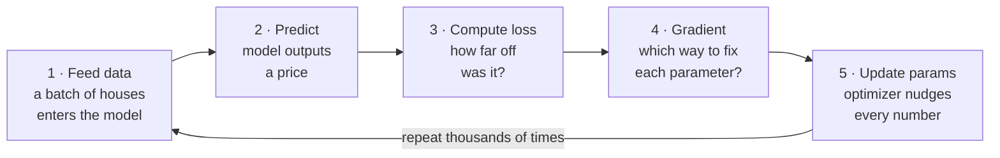

# How Machine Learning Works

**CSC-114 Artificial Intelligence I · Module 3 Reading (Deck 1)**
*Companion to Chollet & Watson, "Deep Learning with Python," 3rd Edition (Manning). This is the conceptual on-ramp. The Chapter 3 notes (Deck 2) cover the frameworks — Keras, TensorFlow, PyTorch, JAX — that run everything below in real Python code.*

---

## The one-sentence version

> Machine learning is the process of slowly adjusting a model's numbers until its predictions stop being wrong — and the whole thing runs as one short loop, repeated thousands of times.

Everything in this reading is just the parts of that loop, explained one at a time. We'll use a single running example the whole way through: **predicting house prices.**

---

## 1. Two ways to get a computer to do a job

There are two fundamentally different ways to make a computer produce an answer.

**Traditional programming:** *you* write the rules. You hand the computer the rules plus the data, and it gives back an answer.

```
   if bedrooms > 3 and sqft > 2000:
       price = "high"
```

This works great when the rules are simple and you actually know them. It falls apart when reality is complicated — there are too many rules, and they interact in ways no human can hand-write.

**Machine learning:** the *model* writes the rules. You hand it the data **and** the answers, and it figures out the rules on its own.

```
   TRADITIONAL PROGRAMMING            MACHINE LEARNING
   ──────────────────────             ────────────────
   Rules + Data → Answers             Data + Answers → Rules
   (you write the rules)              (the model finds the rules)
```

Show a machine-learning model 1,000 houses along with the real price each one sold for, and it works out the patterns by itself — no human writing `if` statements.

---

## 2. Meet the dataset: house prices

We have **1,000 houses.** For each one we know three things about the house, plus the price it actually sold for.

| Square Footage | Bedrooms | Location Score | Sale Price (target) |
|---|---|---|---|
| 1,400 sq ft | 3 | 7 / 10 | $290,000 |
| 2,100 sq ft | 4 | 9 / 10 | $485,000 |
| 900 sq ft | 2 | 5 / 10 | $175,000 |
| 3,200 sq ft | 5 | 8 / 10 | $620,000 |
| … | … | … | … |

Two pieces of vocabulary, and they'll follow you through the whole course:

- **Features** — the inputs. Here: square footage, bedrooms, location score. They are *what the model gets to look at.*
- **Target** — the answer we want the model to predict. Here: the sale price. During training, we know the real target, so we can check the model's guesses.

The model never sees the price ahead of time when we test it. Its whole job is to look at the three features and predict the target.

---

## 3. The model and its parameters

A **model** is just a mathematical function with adjustable knobs. Those knobs are called **parameters** — and they come in two flavors, **weights** and **biases**. You don't need the math yet. You only need the picture: a model is a function whose behavior is controlled by a big pile of numbers you can turn up or down.

**At the very start, those numbers are random.** So the model's first predictions are terrible — and that is completely fine. That's where every model begins.

```
     INPUT                  MODEL                    PREDICTION
   1,400 sq ft   ──►   adjustable parameters   ──►    $800,000
   3 bedrooms          (random at first)              (way off!)
   location 7

                              actual price:  $290,000
                              the model was  $510,000 off
```

That $510,000 gap is not a disaster. It is the single most useful thing in machine learning: **the error is the signal we use to improve the model.** No error, no information about which way to adjust the knobs. A wrong prediction is not a failure — it's the exercise rep that makes the next prediction better.

---

## 4. Two kinds of problem

Before you can train anything, you have to know what *kind* of answer you're predicting. This choice decides which loss function you use (loss is the topic of the next section).

| | **Regression** | **Classification** |
|---|---|---|
| Goal | Predict a **number** | Predict a **category** |
| Output | Continuous — any value | One of a fixed set of labels |
| Examples | House price: $290,000<br>Tomorrow's temp: 72°F<br>Project length: 14 days | Email: spam / not spam<br>Image: cat / dog / bird<br>Transaction: fraud / legit |
| Standard loss | **Mean Squared Error (MSE)** | **Cross-Entropy** |

Our house-price problem is **regression** — we're predicting a dollar amount, which can be any value. So we'll use **MSE** as our loss.

---

## 5. The loss: one number for "how wrong"

After every prediction, we need a single number that says how wrong the model was. That number is the **loss.** The rule is simple:

> **Smaller loss is better.** Training's entire job is to push this number down.

Here's the loss shrinking over 40 rounds of training on the house-price model. (Each round through the data is called an **epoch** — more on that in Section 8.)

```
   Loss over 40 epochs (house-price model), shown as "dollars off":

   Epoch 1    ██████████████████   $510k off   ← random start, very wrong
   Epoch 10   █████████████        $380k off
   Epoch 20   ████████             $240k off
   Epoch 30   █████                $140k off
   Epoch 40   ██                   $55k off    ← much closer
```

What the loss tells us:

- **Big loss** → the prediction is very wrong.
- **Small loss** → the prediction is close.
- **Zero loss** → perfect (basically never happens in real life).
- **Goal of training** → reduce the loss as much as possible.

> **One honest detail:** for regression, MSE doesn't just measure how many dollars off you were — it *squares* each miss before averaging them. That means a few enormous misses hurt the loss far more than many tiny ones, which pushes the model to avoid big mistakes. The "dollars off" labels above are the friendly version of that idea.

---

## 6. The gradient: which way to improve?

We know the model is wrong. But a model can have thousands of parameters. *Which* ones should change, and in *which direction?* That's what the **gradient** answers.

The gradient gives **one value per parameter.** If the model has 1,000 parameters, there are 1,000 gradient values — one for each knob — and each value carries two pieces of information: a **direction** (which way to turn the knob) and a **strength** (how much this knob matters right now).

```
   loss
    │  ●  ← "we are here"  (high loss, bad predictions)
    │   \
    │    \    the gradient points the way downhill
    │     \________ ● ________/   ← minimum = lowest possible loss (the goal)
    └──────────────────────────────►  parameter value
```

Reading a single gradient value:

| Gradient value | What it means | So you should… |
|---|---|---|
| **positive (+)** | loss goes *up* if this knob goes up | **decrease** this parameter |
| **negative (−)** | loss goes *up* if this knob goes down | **increase** this parameter |
| **big number** | this knob has a **large** effect on the loss | move it a lot |
| **small number** | this knob **barely matters** right now | move it only a little |

The framework computes all of these gradients at once — every knob, every step — using an algorithm called **backpropagation.** You met backprop in Chapter 2; here, just trust that the gradient for every parameter shows up automatically.

---

## 7. The optimizer: actually making the change

The gradient tells us *which way* to move each parameter. The **optimizer** decides *how big a step* to take — and then actually performs the update. The core update rule is one line:

```
   new parameter = old parameter − (learning rate × gradient)
```

This runs for **every single parameter, after every batch of training data.** Thousands of parameters, nudged a tiny bit at a time, over and over.

The **learning rate** is the size of each step. Getting it right matters:

- **Too small** → the model creeps along; training takes forever.
- **Too large** → the model overshoots the target and never settles down.
- **Just right** → fast, stable learning.

You rarely have to invent an optimizer. Two common ones cover most cases:

| Optimizer | What it's like |
|---|---|
| **SGD** (Stochastic Gradient Descent) | Simple and reliable. Uses a fixed step size. |
| **Adam** | Smart, adaptive step sizes that adjust per parameter. The usual default — start here. |

---

## 8. The training loop: it all fits together

Every piece above is one stage of a single repeating cycle. This loop *is* machine learning.



| Step | What happens | Section above |
|---|---|---|
| 1. Feed data | A batch of houses enters the model | §2 |
| 2. Predict | The model outputs a price guess | §3 |
| 3. Compute loss | One number: how far off was it? | §5 |
| 4. Gradient | One value per parameter: which way to adjust? | §6 |
| 5. Update params | The optimizer nudges every parameter | §7 |

Then it loops back to step 1 and does it all again — thousands of times. With every pass, the loss gets a little smaller and the predictions get a little better.

> **The payoff:** every deep learning framework — Keras, PyTorch, TensorFlow, JAX — automates *exactly this loop.* Once you understand the five steps, you understand what the framework is doing for you under the hood.

---

## 9. Connecting concepts to code

Before training starts, you make two key choices: **what counts as "wrong"** (the loss) and **how the model improves** (the optimizer). In Keras, that's a single line:

```python
model.compile(optimizer="adam", loss="mean_squared_error")
```

Two strings, two decisions you now understand:

| In the code | What it is | Plain English |
|---|---|---|
| `optimizer="adam"` | the **optimizer** | Controls how parameters get updated. Adam is the smart, adaptive default that works well for most problems. |
| `loss="mean_squared_error"` | the **loss function** | Defines what "wrong" means. MSE for regression (predicting numbers); cross-entropy for classification (predicting categories). |

That's the whole bridge: the concepts from Sections 4–7 map directly onto the words you type. **In Deck 2, we'll meet the frameworks that make all of this run in Python — and watch the loop run live.**

---

## What just happened (consolidation)

Pull it all together in six beats:

1. **Machine learning flips traditional programming.** Instead of writing rules, you give the model data *and answers*, and it finds the rules itself.
2. **A model is a function full of adjustable parameters.** They start random, so the first predictions are terrible — and that's the normal starting point.
3. **The error is the signal.** A wrong prediction tells us exactly how much, and which way, to improve.
4. **The loss turns "how wrong" into one number** you can push down. Pick the loss to match the problem: MSE for regression, cross-entropy for classification.
5. **The gradient says which way to move each parameter; the optimizer decides how big a step and makes the move.** Learning rate is the step size — not too big, not too small.
6. **It's all one loop:** feed → predict → loss → gradient → update, repeated thousands of times. Frameworks automate this loop, and `model.compile()` is where you set the two dials.

---

## Vocabulary quick-reference

| Term | Plain-English definition |
|---|---|
| **Feature** | An input the model looks at (square footage, bedrooms…). |
| **Target** | The answer the model is trying to predict (sale price). |
| **Parameter** | An adjustable number inside the model (weight or bias). |
| **Prediction** | The model's guess for the target. |
| **Loss** | One number measuring how wrong a prediction was. Smaller is better. |
| **Regression** | A problem where you predict a number. Loss: MSE. |
| **Classification** | A problem where you predict a category. Loss: cross-entropy. |
| **Gradient** | One value per parameter: which way and how strongly to adjust it. |
| **Backpropagation** | The algorithm that computes all gradients at once. |
| **Optimizer** | The rule that updates parameters using the gradients. |
| **Learning rate** | The size of each update step. |
| **Epoch** | One full pass through all the training data. |
| **Training loop** | The repeating cycle: feed → predict → loss → gradient → update. |

---

*Source: Reverse-engineered from the Module 3 introductory slide deck ("How Machine Learning Works"). Concepts align with Chollet & Watson, "Deep Learning with Python," 3rd Edition (Manning), Chapters 2–3; free online at deeplearningwithpython.io. Code shown is standard Keras API usage for illustration.*
